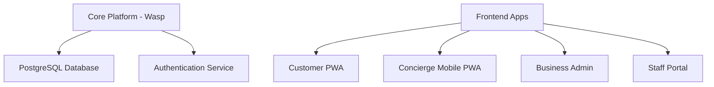
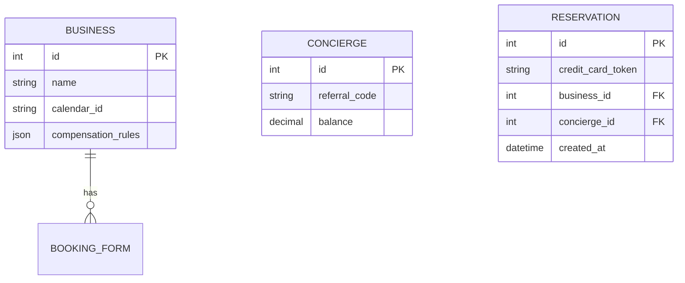

# La Casita Booking System Architecture

## System Overview

## Technology Stack
- **Core Platform**: Wasp (React + Node.js + Prisma)
- **Database**: PostgreSQL
- **Mobile Apps**: React Native Web (PWA)
- **Payment Processing**: Stripe
- **Calendar Sync**: Google Calendar API + OpenTable Sync

## Core Components

### 1. Business Web Admin
- Reservation management dashboard
- Concierge approval system
- Compensation rule configuration
- Calendar sync settings

### 2. Concierge Portal
- Business directory with compensation rates
- QR code generation/sharing
- Earnings dashboard
- Reservation history

### 3. Concierge Mobile PWA
- QR code scanning
- Credit card scanning (Card.IO)
- Mobile-optimized booking flow
- Offline capability

### 4. Customer Booking PWA
- Responsive design
- QR code booking
- Credit card scanning
- Guest checkout

### 5. Staff Portal
- Internal reservation creation
- Mobile-optimized for staff
- Real-time availability checks

## Database Schema

## Implementation Roadmap
1. **Week 1**: Core platform setup
   - Wasp initialization
   - Auth system implementation
   - Database schema migration

2. **Week 2**: Concierge features
   - Mobile PWA development
   - QR code system
   - Credit card scanning

3. **Week 3**: Business features
   - Admin panel
   - Staff portal
   - Calendar sync

4. **Week 4**: Customer experience
   - Booking PWA
   - Payment integration
   - Testing & deployment