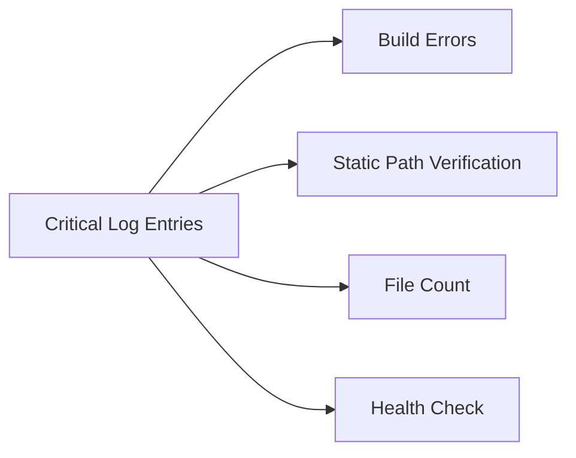

# Render Log Analysis Guide

## Key Log Patterns to Share


## 1. Build Process
Look for:
- `npm run build` success/failure
- Wasp compilation errors
- Static file generation

## 2. Runtime Initialization
Focus on:
```
[SERVER] Static file path: /app/client/build
[SERVER] Found X files in build directory
[ERROR] messages
```

## 3. Health Check
Expected:
```
[HEALTH] Status check received
{ status: 'ok', version: ..., buildPath: ... }
```

## Common Issues
1. **Empty Build Directory**:
   - Fix: Check Dockerfile build steps
2. **Path Mismatch**:
   - Fix: Adjust path in serverSetup.js
3. **Missing Dependencies**:
   - Fix: Verify package.json